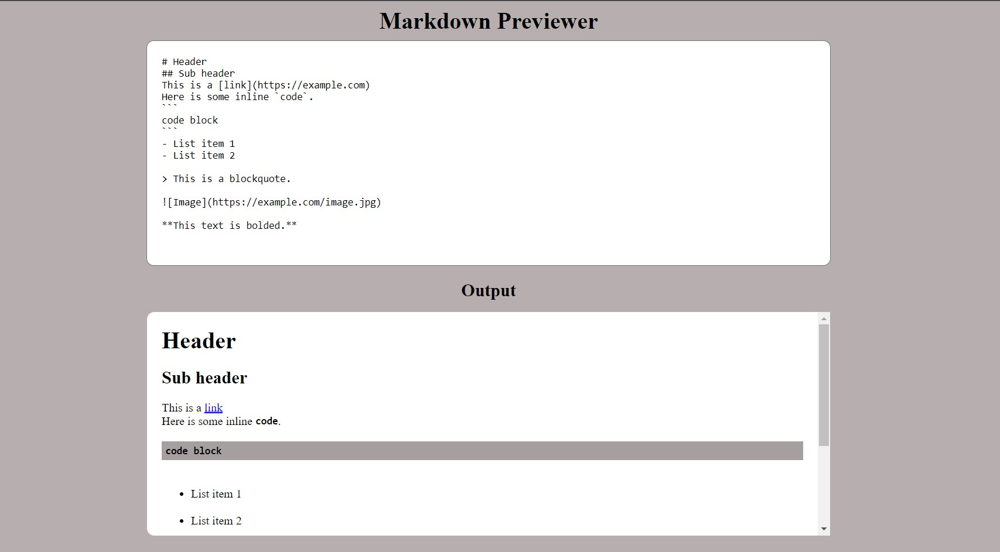

# Markdown Previewer
The Markdown Previewer is a web application that allows you to write and preview Markdown content in real-time. It uses the `marked` library to convert Markdown syntax into HTML for rendering.

## Preview

## Features
- Live Markdown preview: As you type in the editor, the preview section updates in real-time to show the rendered Markdown content.
- Support for Markdown syntax: The previewer supports various Markdown elements such as headers, links, code blocks, lists, blockquotes, images, and formatting (e.g., bold, italic).

## Technologies Used
The Markdown Previewer is built using the following technologies:
- React: A JavaScript library for building user interfaces.
- marked: A library for parsing Markdown and converting it to HTML.
- Bootstrap: A popular CSS framework for styling the application.
- Babel: A JavaScript compiler that enables the use of the latest JavaScript features in the browser.

## Getting Started
To run the Markdown Previewer locally, follow these steps:
1. Clone the repository: `git clone https://github.com/Kalutu/Markdown-Previewer`
2. Navigate to the project directory: `cd markdown-previewer`
3. Install the dependencies: `npm install`
4. Start the development server: `npm start`
5. Open your web browser and visit `http://localhost:3000` to access the Markdown Previewer.

## Usage
1. Enter your Markdown content in the editor section of the application.
2. The preview section will update in real-time to display the rendered Markdown content.
3. Modify the Markdown content to see the preview update dynamically.

## Contributing
Contributions to the Markdown Previewer are welcome! If you find any issues or have suggestions for improvements, please feel free to open an issue or submit a pull request.

## Credits
This Markdown Previewer project is part of the [FreeCodeCamp Frontend Certification](https://www.freecodecamp.org/learn/front-end-libraries/) course. It was completed as one of the required projects in the curriculum.

FreeCodeCamp (FCC) is a nonprofit organization that offers a comprehensive web development curriculum and certifications. The Frontend Certification focuses on frontend libraries and frameworks like React, and it covers various topics including HTML, CSS, JavaScript, and more.

Learn more about FreeCodeCamp and their educational programs on their official website: [https://www.freecodecamp.org/](https://www.freecodecamp.org/)

